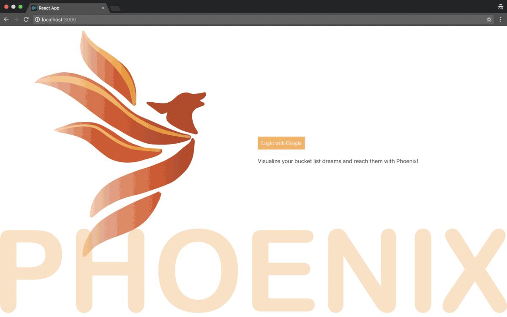

## Phoenix
A social media application for people to create items for themselves to add to their own bucket list. 

## Motivation
Our motivation for this application was for people to be able to put all their bucket list items in one place because these types of things can be easily forgotten by most.
 
## Screenshots
A gif of a brief run-through of our application has been added in for reference and a quick overview of our application.

Phoenix:

## Tech/framework used
<ul><b>Built with</b> 
    <li>HTML5</li>
    <li>CSS</li>
    <li>GettyImages</li>
    <li>Bulma</li>
    <li>Google OAuth API</li>
    <li>JavaScript</li>
    <li>MongoDB</li>
    <li>Node/Express</li>
    <li>Mongoose</li>
    <li>GitHub</li>
    <li>Heroku</li>
    <li>React Date Picker</li>
    <li>React Horizontal Timeline</li>
</ul>

## Features
Our application stands out because of many variables we have incorporated within our website. However, we think it really stands out because of features suchs as a polished UI and UX, dynamic updates, Google OAuth enabled User sign-in, and an individualized dashboard page.

## Installation
To get our application running on your personal computer
<ul>
<li>Before you begin make sure to have Mongo installed on your local machine</li>
<li>Git clone the repo</li>
<li>yarn install within the main repo and then "cd client" and yarn install again, this should install everything you need from the package.json file we have within our MVC.</li>
<li>In one CLI type in Monogod to start Mongo</li>
<li>Now in a separate CLI move into your repo within your CLI and start the server, once that is done you should be able to see our page on you your browser using localhost://3000.</li>
</ul>

However, you may also feel free to visit the application deployed through Heroku at <a href="https://phoenix-list.herokuapp.com/">Phoenix!</a>

## API Reference

<a href="https://developers.google.com/identity/protocols/OAuth2">Google OAuth 2.0</a>

## Credits
<ul>
<li><a href="https://github.com/abreaw">Brea Torres</a></li>
<li><a href="https://github.com/weirichm">Miriam Bonano</a></li>
<li><a href="https://github.com/snz1210">Saima Zia</a></li>
<li><a href="https://github.com/patella08">Anisha Patel</a></li>
</ul>

